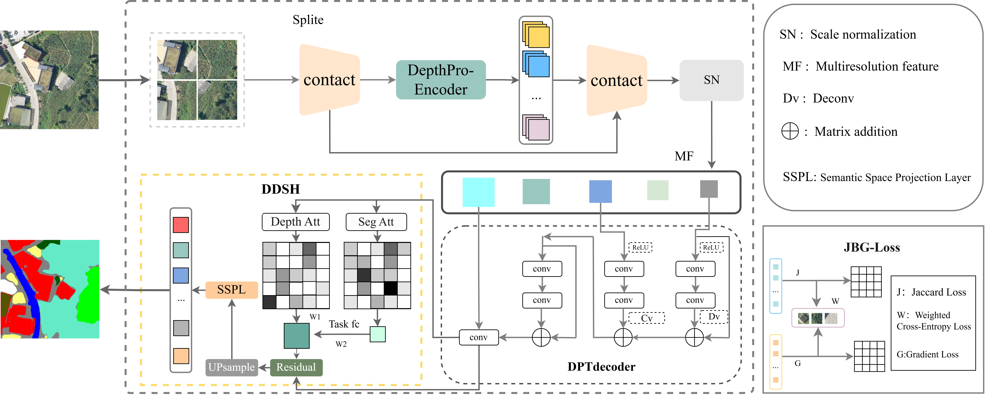

## Mask2Depth: Depth-Guided Boundary Learning for Agricultural Image Segmentation
This model leverages depth weight information from the zero-shot depth estimation model ​​Depth Pro**[Depth Pro: Sharp Monocular Metric Depth in Less Than a Second](https://arxiv.org/abs/2410.02073)**. We extend our highest respect to its authors:
Aleksei Bochkovskii, Amaël Delaunoy, Hugo Germain, Marcel Santos, Yichao Zhou, Stephan R. Richter, and Vladlen Koltun.

Our work is collaboratively developed by:
Bin Liao, Baoping Zhou, Xiaofei Li, Guoying Qiu.




Mask2Depth demonstrates exceptional performance in three boundary-sensitive agricultural scenarios. Quantitative boundary analysis reveals 2-5× improvement in boundary F1-score within 5-pixel tolerance compared to conventional methods. Visual validations confirm superior robustness against leaf fragmentation and soil artifact interference. This research advances boundary-aware agricultural vision systems, establishing a new paradigm for precision agriculture applications requiring fine-grained localization.
Our dataset is publicly available at ​​ScienceDB**[https://www.scidb.cn/detail?dataSetId=0dadce6de3c44354bcd73e09e7699410]**​​.

.

Installation
We recommend using a conda virtual environment. Install Mask2Depth with:
```bash
conda create -n mask2depth -y python=3.10
conda activate mask2depth

pip install -e .
```
Download depth weights:
```bash
sh get_pretrained_models.sh
```

## Training
Modify required configurations in src/mask2depth/cfg/config.yaml
​​Generate class weights for COCO-format annotations​​:

```bash
cd src/mask2depth

python utils.py
```
Update class weights in config.yaml and specify dataset paths

## Start training:
Modify the training and validation dataset paths in the YAML configuration file​
```bash
python train.py
```
The Mask2Depth model weights will be saved to the save_path directory specified in the YAML file​

## Inference
Customize class colors in deploy_torch.py, then execute:
```bash
python deploy_pytorch.py
```

## Evaluation
Boundary F1 (BF1) metric code will be updated subsequently.
Other metrics (PA, mIoU) are output during training.

## Citation
If using our work, please cite:
```bibtex
@article{Bochkovskii2024:arxiv,
  author     = {Aleksei Bochkovskii and Ama\"{e}l Delaunoy and Hugo Germain and Marcel Santos and
               Yichao Zhou and Stephan R. Richter and Vladlen Koltun}
  title      = {Depth Pro: Sharp Monocular Metric Depth in Less Than a Second},
  journal    = {arXiv},
  year       = {2024},
  url        = {https://arxiv.org/abs/2410.02073},
}
```
Pending paper acceptance, please use:
```bibtex
@unpublished{Liao2024:mask2depth,
  author    = {Bin Liao and Baoping Zhou and Xiaofei Li and Guoying Qiu},
  title     = {Mask2Depth: Depth-Guided Boundary Learning for Agricultural Image Segmentation},
  note      = {Under Review},
  year      = {2025},
  url       = {https://github.com/LR-ddd/Mask2depth},
}
```
## License
This sample code is released under the LICENSE.
Model weights are distributed under the LICENSE.

## Acknowledgements
Our codebase builds upon multiple open-source contributions (see ACKNOWLEDGEMENTS.md).
Complete references and dataset details are available in our paper.
